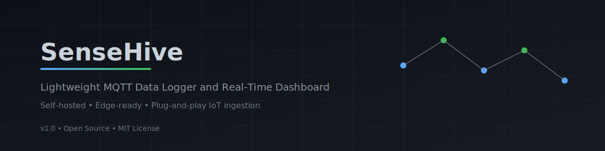
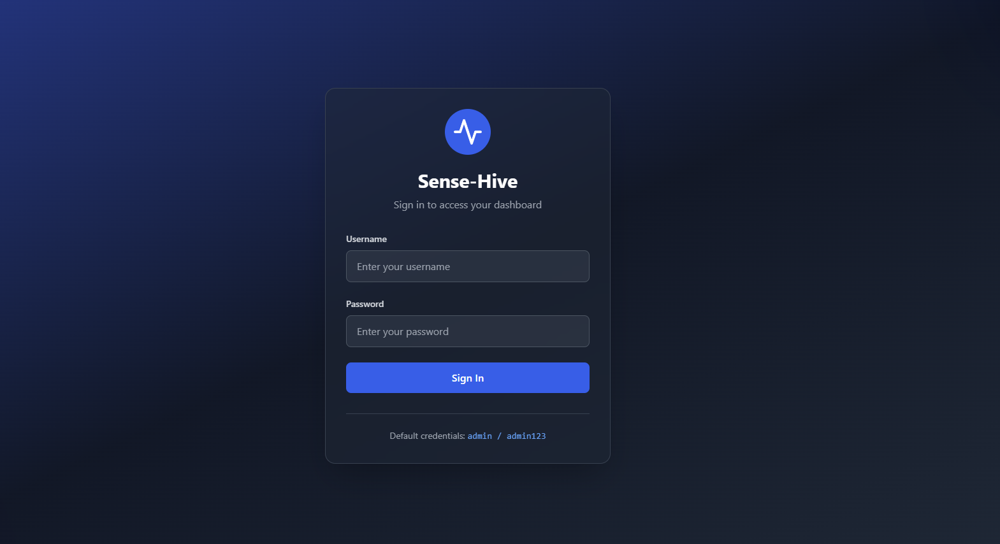
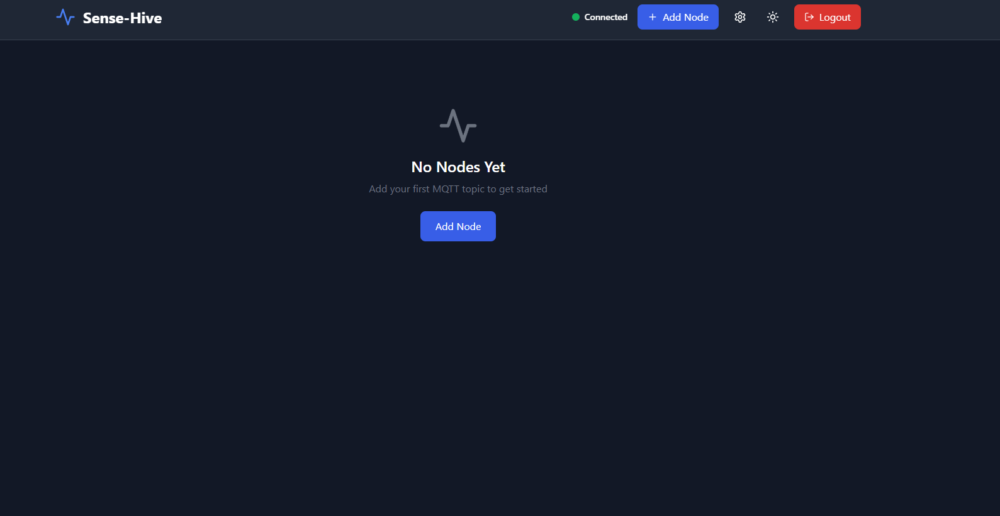
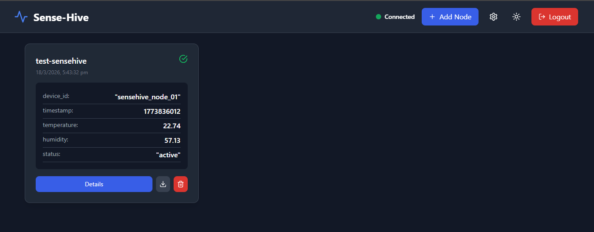
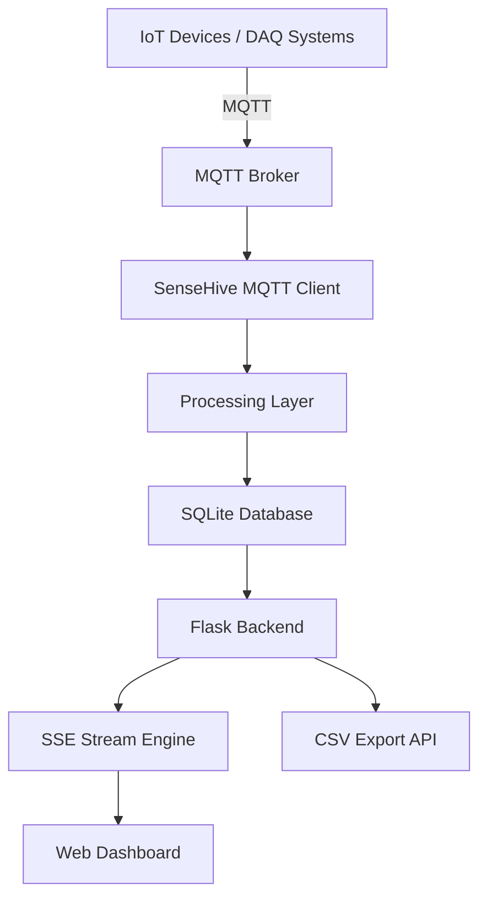
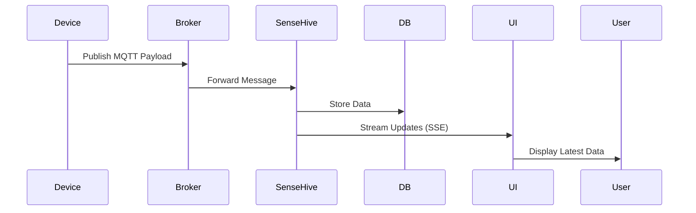

<p align="center">
  
</p>

      
> Lightweight MQTT dashboard and logger - like uptime-kuma, but for IoT data.
> Designed for quick, local-first IoT data visibility without heavy infrastructure.

---
## Quick Start (30 seconds)

Run SenseHive instantly:

```bash
docker run -d -p 5000:5000 devprincekumar/sense-hive:latest
```
Open your browser:
```
http://localhost:5000
```
Start publishing MQTT data (or use the included test script) to see live updates immediately.

## Dashboard Preview

<p align="center">
  
  
</p>

<p align="center">
  
</p>

## Overview

SenseHive is a self-hosted MQTT data ingestion and visualization system designed for **rapid deployment, minimal overhead, and reliable local operation**.

It enables engineers and teams to:

* Ingest MQTT data streams
* Persist data locally
* Visualize real-time telemetry
* Export structured datasets

The system is optimized for **edge environments, internal infrastructure, and low-resource devices**, where traditional IoT platforms are unnecessarily complex or resource-intensive.

## Example Use Cases

- Monitoring environmental sensors (temperature, humidity, AQI)
- Collecting telemetry from distributed IoT nodes
- Rapid prototyping of MQTT-based systems
- Internal dashboards for lab or field deployments
  
---

## Why SenseHive Was Built

In practical IoT deployments involving weather monitoring systems, DAQ nodes, and distributed sensor networks, existing solutions were evaluated but did not meet the need for:

* Fast setup
* Lightweight execution
* Direct data visibility

Most available tools required:

* Complex configuration
* Multiple dependent services
* Higher system resources

The requirement was clear:

> A simple, plug-and-play system that can be deployed instantly and start logging MQTT data without setup overhead.

SenseHive was built to meet that need.

The experience aimed to replicate the simplicity of tools that offer immediate usability with minimal configuration - but for MQTT-based data systems.

---

## Design Principles

* Simplicity over complexity
* Edge-first deployment
* Minimal dependencies
* One-command startup
* Reliable local operation

---

## System Architecture



---

## Data Flow



---

## Key Features

### MQTT Data Ingestion

* Compatible with any MQTT-compliant device
* Default public broker for quick testing
* Topic-based subscription

### Dynamic Data Storage

* Automatic topic-to-table mapping
* SQLite-based persistent storage
* Timestamped entries

### Real-Time Dashboard

* Live updates via Server-Sent Events
* Displays the latest 50 entries per topic
* Topic-based data visualization cards

### Data Export

* CSV export per topic
* Easy data extraction for analysis

### Deployment Flexibility

* Docker-based one-click deployment
* Multi-architecture support (AMD64 and ARM)
* Local execution without Docker

---

## Folder Structure

```
.
├── version-1.1/
│   ├── app.py
│   ├── Dockerfile
│   └── application files
│
├── docker-compose/
│   ├── docker-compose-amd.yml
│   └── docker-compose-arm.yml
│
├── test-sensehive/
│   └── test publisher script
│
├── README.md
└── LICENSE
```

---

## Deployment

### Option 1: Docker (Recommended)

#### Pull Images

```bash
docker pull devprincekumar/sense-hive:latest
```

* For AMD64 / x86 systems

```bash
docker pull devprincekumar/sense-hive:arm-pi-5
```

* For ARM systems (Raspberry Pi 5 optimized)

---

#### Run Container

```bash
docker run -d \
  -p 5000:5000 \
  -v $(pwd)/data:/app/data \
  devprincekumar/sense-hive:latest
```

---

### Option 2: Docker Compose

Use the provided compose files:

* `docker-compose-amd.yml`
* `docker-compose-arm.yml`

---

### Option 3: Local Run (Without Docker)

```bash
cd version-1.1
python app.py
```

Access the dashboard:

```
http://localhost:5000
```

---

## Default Access

```
Username: admin
Password: admin123
```

---

## Data Persistence

Database location:

```
/app/data/iot_dashboard.db
```

Note:

* Without volume mounting, data will not persist across container restarts

## Configuration

The default setup uses a public MQTT broker for quick testing.

You can modify:
- MQTT broker (local or remote)
- Credentials
- Timezone settings

Configuration is currently handled within the application code and UI, with extended configurability planned in future releases.

---

## Test Setup (Quick Validation)

A test publisher is included to simulate IoT data.

### Step 1: Start SenseHive

Run using Docker or local execution.

---

### Step 2: Run Test Script

```bash
cd test-sensehive
python test_script.py
```

---

### Step 3: Configure Dashboard

* Add topic: `test-sensehive`
* Observe live updates
* View latest 50 entries
* Export data using CSV

---

## Example Payload

```json
{
  "device_id": "sensehive_node_01",
  "timestamp": 1710000000,
  "temperature": 28.5,
  "humidity": 62,
  "status": "active"
}
```

## Performance Benchmarks

Based on internal LAN testing with Docker deployment.
Tested on: Raspberry Pi 5 (8GB) and x86 local system

| Metric                | Value / Range              |
|---------------------|---------------------------|
| Ingestion Rate       | ~1k–3k msgs/min           |
| Devices Supported    | ~20–50 devices            |
| CPU Usage            | ~5–15% (Raspberry Pi 5)   |
| Memory Usage         | ~80–150 MB                |
| Dashboard Latency    | <1 second                 |

> Note: Values are indicative and may vary depending on workload and hardware.

---

## Comparison with Existing Solutions

| Feature / Tool       | SenseHive           | ThingsBoard    | Node-RED        | Grafana + MQTT | Home Assistant |
| -------------------- | ------------------- | -------------- | --------------- | -------------- | -------------- |
| Setup Complexity     | Very Low            | High           | Medium          | High           | Medium         |
| One-Click Deployment | Yes                 | No             | Partial         | No             | Partial        |
| Resource Usage       | Low                 | High           | Medium          | High           | Medium         |
| MQTT Native Support  | Yes                 | Yes            | Yes             | Plugin-based   | Yes            |
| Built-in Storage     | Yes                 | Yes            | No              | No             | Yes            |
| Real-Time Dashboard  | Yes                 | Yes            | Limited         | Yes            | Yes            |
| Data Export          | Yes                 | Yes            | Custom          | Yes            | Limited        |
| Edge Device Friendly | Yes                 | Limited        | Yes             | Limited        | Limited        |
| Learning Curve       | Low                 | High           | Medium          | High           | Medium         |
| Intended Use Case    | Lightweight logging | Enterprise IoT | Flow automation | Observability  | Smart home     |

---

## Positioning

SenseHive is designed as:

> A lightweight, plug-and-play MQTT data logger and dashboard for quick deployment and internal use.

It is not intended to replace full-scale IoT platforms.

---

## When to Use SenseHive

- You need quick MQTT data logging without heavy setup  
- You are working with edge devices (ESP32, Raspberry Pi, DAQ systems)  
- You want a self-hosted, lightweight dashboard  
- You need fast prototyping or internal monitoring  

---

## When NOT to Use SenseHive

- You need large-scale distributed IoT infrastructure  
- You require multi-tenant SaaS architecture  
- You need advanced analytics or big data pipelines  
- You expect enterprise-grade scalability out of the box

---

## Current Limitations

* SQLite may not scale for high-throughput systems
* No data retention policy (planned)
* WAL mode not yet enabled
* Table-per-topic schema limits scalability
* No dynamic schema optimization
* No built-in migration to time-series databases
* Basic authentication system
* No alerting or automation engine

---

## Versioning and Release Status

### v1.0 (Current)

* Stable and tested
* Running in internal LAN environments
* Used for real data aggregation across multiple devices
* Verified over more than two months of continuous usage

---

### v1.1 (Upcoming)

Planned improvements:

* WAL mode for improved database performance
* Data retention policies
* Improved write efficiency
* Schema optimization groundwork

---

## Stability Statement

SenseHive is:

* Reliable for self-hosted and LAN-based deployments
* Suitable for continuous MQTT data logging
* Actively used in internal setups

However, it is still under development toward a fully scalable production-grade platform.

---

## Community Release

This project is being released as open source to:

* Enable wider testing
* Gather feedback from real-world use cases
* Improve scalability and feature set

Contributions, suggestions, and improvements are encouraged.

---

## License

MIT License

---

## Closing Note

SenseHive is built to simplify MQTT-based data logging and visualization without introducing unnecessary complexity.

It is particularly suited for:

* Edge deployments
* Rapid prototyping
* Internal monitoring systems
* Lightweight IoT infrastructures

The focus remains on usability, portability, and practical engineering needs.

---

## Support & Feedback

If you find this useful, consider starring the repository.

Feedback, issues, and contributions are welcome to help improve the project.
